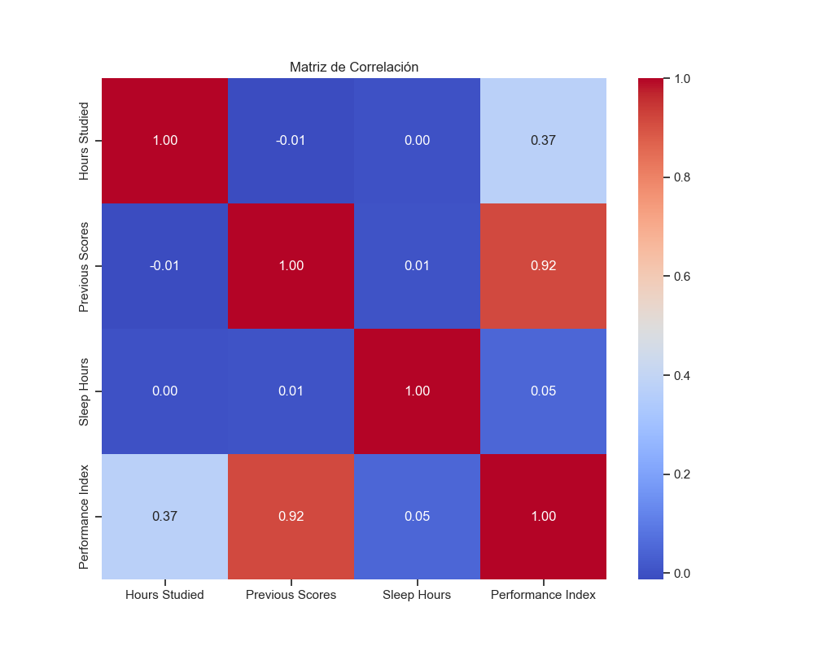

# Laboratorio 2: Algoritmos de Optimización en Machine Learning

Este proyecto explora el uso de algoritmos de optimización en modelos de regresión lineal para predecir el rendimiento académico de estudiantes. Se analizan diferentes métodos de optimización, regularización y proporciones de entrenamiento/prueba, además de incluir visualizaciones 3D interactivas.

para una visualizacion rapida de todo el proyecto se puede ingresar al siguiente enlace (en caso de estar caida se debe esperar 5 minutos para reiniciarse)
[Pagina del Laboratorio](https://flaviofuego-lab2-superopti-potointerfaz-umzikn.streamlit.app)

## Descripción General

[dataset](https://www.kaggle.com/datasets/mitgandhi10/dataset-for-multiple-regression/data)

El objetivo principal es predecir el **Índice de Rendimiento Académico** utilizando características como:

- **Horas de Estudio**
- **Calificaciones Previas**
- **Actividades Extracurriculares**
- **Horas de Sueño**
- **Exámenes de Práctica Realizados**

El proyecto incluye:

1. Análisis exploratorio de datos.
2. Ajuste de modelos de regresión lineal con diferentes configuraciones.
3. Evaluación de métricas de desempeño.
4. Visualizaciones 3D para comprender las relaciones entre variables.

## Estructura del Proyecto

```plaintext
Lab2_superopti/
│
├── lab2.ipynb                # Notebook principal con el análisis y visualizaciones.
├── potointerfaz.py           # Código para la interfaz interactiva.
├── dataset/
│   └── Student_Performance.csv  # Dataset utilizado en el análisis.
├── images/                   # Carpeta para guardar gráficos generados.
│   ├── scatter_matrix.png
│   ├── feature_relationships.png
│   ├── correlation_matrix.png
│   ├── performance_distribution.png
│   ├── extracurricular_boxplot.png
│   ├── model_coefficients.png
│   ├── predictions_vs_actual.png
│   ├── residuals_plot.png
│   ├── 3d_viz_scores_hours.png
│   ├── 3d_viz_scores_sleep.png
│   ├── 3d_viz_hours_papers.png
│   └── 3d_viz_categorical.png
└── README.md                 # Documentación del proyecto.
```

## Instalación

1. Instala las dependencias necesarias:

   ```bash
   pip install -r requirements.txt
   ```

2. Asegúrate de tener el archivo del dataset en la carpeta `dataset/`.

## Uso

1. Abre el archivo `lab2.ipynb` en Jupyter Notebook:

   ```bash
   jupyter notebook lab2.ipynb
   ```

2. Sigue las secciones del notebook para:
   - Analizar el dataset.
   - Entrenar y evaluar modelos.
   - Generar visualizaciones.

3. Para ejecutar la interfaz interactiva, utiliza el archivo `potointerfaz.py`:

   ```bash
   py -m streamlit run potointerfaz.py
   ```

## Resultados Clave

- **Proporción óptima de entrenamiento/prueba**: 70-30.
- **Mejor método de optimización**: Ridge con `alpha=0.1`.
- **R² Score del modelo final**: ~98.9%.
- **Visualizaciones 3D**: Ayudan a comprender las relaciones entre variables y el impacto de las actividades extracurriculares.

## Visualizaciones

### Matriz de Correlación



### Relación 3D: Calificaciones Previas y Horas de Estudio vs Rendimiento


## Resultados de la regresion


## Licencia

Este proyecto está bajo la licencia MIT. Consulta el archivo `LICENSE` para más detalles.
